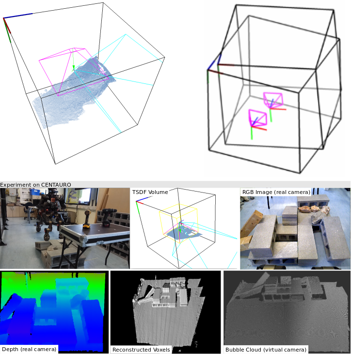

# rxKinFu: Moving Volume KinectFusion for 3D Perception and Robotics
#### Authors: Dimitrios Kanoulas (Dimitrios.Kanoulas AT iit AT it) and Marsette Vona
#### Version: 1.1.0
#### Author's website: https://dkanou.github.io/

(click on the image for a video demonstration)

### Overview
**KinectFusion** is an impressive algorithm that was introduced in 2011 to simultaneously track the movement of a depth camera in the 3D space and densely reconstruct the environment as a Truncated Signed Distance Formula (TSDF) volume, in real-time. In 2012, we introduced the Moving Volume KinectFusion method that allows the volume/camera move freely in the space. In this package, we further develop the Moving Volume KinectFusion method (as **rxKinFu**) to fit better to robotic and perception applications, especially for locomotion and manipulation tasks. We implemented methods to raycast point clouds from the volume using virtual cameras, and use the point clouds for heightmaps generation (e.g., useful for locomotion) or object dense point cloud extraction
(e.g., useful for manipulation). Moreover, we present different methods for keeping the camera fixed with respect to the moving volume, fusing also IMU data and the camera heading/velocity estimation. We also integrate and perform some demonstrations of rxKinFu on the mini-bipedal robot RPBP, our wheeled quadrupedal robot CENTAURO, and the newly developed full-size humanoid robot CogIMon. The code is released as an open-source package, using the Robotic Operating System (ROS) and the Point Cloud Library (PCL).

### Sub-folders
This includes two main sub-folders (and one auxiliary sub-folders); the rxKinFu library itself and the ROS wrapper:

1. **rxkinfu:** the rxKinFu core library

2. **rxkinfu_ros:** the ROS wrapper and intereface for the rxkinfu core library

3. **iamges:** main rxkinfu images

### Publications
The package is based on two papers:

1. "**rxKinFu: Moving Volume KinectFusion for 3D Perception and Robotics**", Dimitrios Kanoulas, Nikos G. Tsagarakis, and Marsette Vona (under submission).

2. "**Moving Volume KinectFusion**", Henry Roth, Marsette Vona, 2012.

### Requirements
1. [OpenNI](http://wiki.ros.org/openni_launch)/[OpenNI2](http://wiki.ros.org/openni2_launch) or a similar range sensor driver.

   * For instance, installing OpenNI2 on ROS Kinetic: `> sudo apt-get install ros-kinetic-openni2-*`

### Installation
~~~~
> mkdir rxkinfu && cd rxkinfu && mkdir src && cd src
> git clone https://github.com/RoViL-Team/rxkinfu.git
> cd ..
> catkin_make
~~~~

### Running the Code
Both sub-folders have excecutables and launch files.

### Citation
If you use this package in your own work, please cite our paper:

"rxKinFu: Moving Volume KinectFusion for 3D Perception and Robotics", Dimitrios Kanoulas, Nikos G. Tsagarakis, and Marsette Vona.

### Possible Errors
1. RGB-D USB Communication through OpenNI is not working:
~~~~
> sudo modprobe -r gspca_kinect
> sudo modprobe -r gspca_main
> sudo vim /etc/openni/GlobalDefaults.ini (Edit: UsbInterface=2)
~~~~
