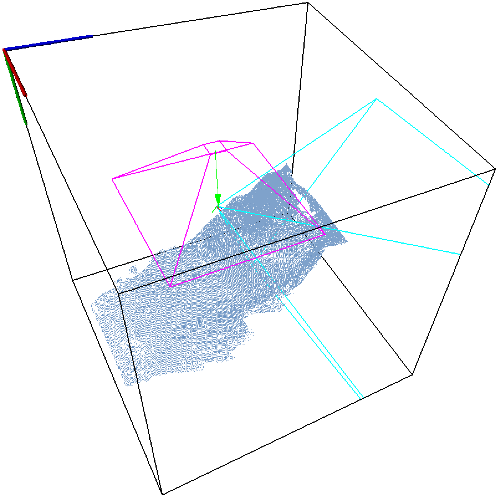

# Kinect Fusion for Robotics, Perception, Etc. (RXKinFu)

 

This is a library and application for [Moving Volume Kinect Fusion](WWW_REL_HOME/mvkinfu/index.html).  It is based on KinFu from [PCL](http://www.pointclouds.org), forked from PCL git b1edb0d9 (11/21/13).  RXKinFu does not depend on the `pcl/gpu` module, and PCL KinFu and RXKinFu can coexist as they are in separate namespaces.

RXKinfu can optionally be compiled with [imucam](WWW_REL_HOME/imucam/index.html) to support grabbing (or reading saved) depth+IMU data.

The original fixed-volume mode is used unless `KinfuTracker::setMovingVolumePolicy()` is called with something other than the default `KinfuTracker::FIX_VOLUME`.  If you are using the `rxkinfu` driver then this can be done by supplying one of the `-mvfc`, `-mvfd`, or `-mvff` command line options.  The first attempts to hold the camera pose fixed in the volume by transforming the volume when the camera has moved beyond a threshold; the latter two attempt to hold the camera location fixed in the volume but drive the volume orientation from specified down and forward vectors.  Those vectors can be set from the sensed gravity direction (`-downgrav`), if IMU data is available, and respectively either the recent camera velocity direction (`-headvel`) or the current camera direction (`-headcam`).

The code may be of use even if you don't need moving volume features.  Some refactoring has been done to improve extensibility and reusablility, and other features have been added including the possibility to read PCLZF and [TUM](http://vision.in.tum.de/data/datasets/rgbd-dataset) format datasets (if compiled with imucam).  (It was once possible to read TUM format with PCL KinFu `-eval` mode but that has been disabled in PCL for a while; the `rxkinfu` options `-eval -imucam_reader DIR -tum` should mostly ressurect this functionality.)

Original [KinectFusion](http://research.microsoft.com/en-us/projects/surfacerecon) algorithm by Newcombe, Izadi et al.

Original code Copyright (c) 2011, Willow Garage, Inc; written mostly by Anatoly Baskeheev, Itseez Ltd.

New code Copyright (c) 2014, Marsette Vona as noted.  All code is BSD Licensed.

## Changes vs KinFu from PCL
*   added moving volume features
*   added FIFO queue for input frames, default max size 10 frames, set or disable with `-mdq` option (this is useful to avoid hiccups when moving volume transforms occur, though there is a latency penalty if the FIFO starts to fill)
*   build as library in addition to executable app
*   added optional input from [imucam](WWW_REL_HOME/imucam/index.html), see `-imucam_grabber` and `-imucam_reader` command line options
*   reworked timing display on console in `kinfu_app.cpp`
*   split out reusable code from `kinfu_app.cpp`: `cloud_view.[h,hpp,cpp]`, `image_view.[h,cpp]` `kinfu_app.[h,cpp]`, renamed driver `rxkinfu.cpp`
*   rename namespace `pcl::gpu` to `rxkinfu`, `pcl::device` to `rxkinfu::device`
*   removed dead code: `corresp.cu *capture* evaluation.cpp kinfu_app_sim.cpp`
*   changed `private` class members to `protected`, made most member functions `virtual`
*   added factory methods like `KinfuTracker::makeTsdfVolume()` to enable subclasses to use alternate implementations of main components
*   broke up `KinfuApp::mainLoop()` and `KinfuApp::execute()` into subfunctions
*   broke up `KinfuTracker::operator()` into subfunctions, renamed to `KinfuTracker::execute()`
*   renamed class `TSDFVolume` to `TsdfVolumeHost` to disambiguate vs `TsdfVolume`
*   removed RGB integration and registration code
*   use `pcl::visualization::FloatImageUtils::getVisualImage()` to show raw depth image in false-color
*   merged in needed code from `gpu/containers`
*   fixed some misspellings
*   disabled copy constructor and assignment operator for most classes
*   changed build system to make from cmake

The `rxkinfu` driver has a number of new or reimplemented command line options.

*   reimplemented `-eval`
*   added `-mdq <n>` to set max FIFO input frame queue size
*   Added `-vsize <w,h,d>` to set the volume size in meters with independent
    control of each dimension.
*   Added `-step` for a single-stepping mode where each frame is processed only
    after the user hits the spacebar.  Added `-pause` option which is similar
    but only pauses before the very first frame.
*   Added `-ndv` and `-nrv` to suppress display of the corresponding
    visualization windows.
*   Added `-indcam` to turn on independent graphics camera mode initially and
    `-bubcam` to turn on bubble-fixed camera initially.  Hitting I cycles among
    independent camera, kinect-fixed camera, and a bubble-fixed camera when the
    moving volume bubble is enabled (see below).  The bubble-fixed camera looks
    at the bubble reference point and is located offset from that point by a
    default value confgurable with the `-bubcamloc` option.
*   Added `-sc [ts]` to display of the raycast point cloud of the scene from the
    current graphics camera viewpoint in the "Scene Cloud" window.  This is
    similar to the original `-cc` switch, which is still available, but does not
    display in a separate visualizer window.  Also the cloud may optionally be
    shown as a triangle mesh generated with `OrganizedFastMesh`, possibly with a
    decimated triangle size `ts`.  Hitting D toggles the scene cloud display and
    cycles through the triangle sizes.
*   Added `-drawcam` to display of the kinect frustum as it moves around.
    Toggle it by hitting K.
*   Added `-campos <x,y,z>` and `-camaa <angle,x,y,z.` to set the initial camera
    pose in the volume.

Most of these are also accessible as `KinfuTracker` or `KinfuApp` APIs.  See the header files for additional doc.

## Moving Volume Options

A number of options have been added to the `rxkinfu` driver to enable and configure the moving volume algorithm.  Most of these are also accessible as `KinfuTracker` or `KinfuApp` APIs.  See the header files for additional doc.

The core moving volume options are `-mvf{c,d,f}` which correspond to the moving
volume policies defined in `KinfuTracker::MovingVolumePolicy` (in
`kinfu_tracker.h`): `FIX_CAMERA_IN_VOLUME`, `FIX_DOWN_THEN_FWD_IN_VOLUME`,
`FIX_FWD_THEN_DOWN_IN_VOLUME`.

`FIX_CAMERA_IN_VOLUME`: Transform volume (rotate and translate) as needed to keep camera at its initial pose relative to volume frame.

`FIX_DOWN_THEN_FWD_IN_VOLUME`: Rotate volume first to keep volume +y direction parallel to a specified down vector, then to orient volume +z as close as possible to a specified forward vector. The volume is also automatically translated to keep the camera at its initial location in volume frame.
      
`FIX_FWD_THEN_DOWN_IN_VOLUME`: Rotate volume first to keep volume +z direction parallel to a specified forward vector, then to orient volume +y as close as possible to a specified down vector. The volume is also automatically translated to keep the camera at its initial location in volume frame.

Moving volume is disabled unless one of these policies is set.

The moving volume algorithm can be modified with the options `-mvcnn` (check
nearest neighbor), `-mvcv` (check valid), `-mvdthresh <t>` (distance threshold),
and `-mvathresh <t>` (angle threshold); see the corresponding moving volume APIs
in `KinfuTracker` for more details on those.  Note that the distance and angle
thresholds can be specified as `inf` (without the quotes), and setting an
infinite angle threshold makes the moving volume only do volume shifts.

For `-mvf{d,f}` the moving volume down and forward vectors default to +y and
+z in the volume; more interesting settings are available with `-downgrav`, `-headvel`, and `-headcam`.

`-downgrav` sets the moving volume down vector equal to the gravity vector from an IMU mounted to the camera.  Must be used with `-imucam_grabber` or `-imucam_reader`.

The `-drawgrav` and `-drawdown` options turn on graphical renderings of the
corresponding vectors (in magenta and green, respectively), but only if the
bubble is also currently shown (see below).

`-headvel` and `-headcam` estimate the forward vector either as the recent
camera velocity (`-vthresh` and `-vweight` control a running average filter for
that) or as the current camera +z vector.

The `-drawvel` and `-drawhead` options turn on graphical renderings of the
corresponding vectors (in yellow and cyan, respectively), but only if the bubble
is also currently shown (see below).

The `-bs`, `-br`, and `-bo` parameters control a graphical rectangular prism
"bubble" that moves with camera.  The bubble reference point is offset from the
camera location by the vector passed to `-bo`.  The bubble orientation is
axis-aligned with the TSDF volume. The `-bs` and `-br` options take 0 to 6 float
arguments in order `b f l r k t`.  The (b)ottom, (f)ront, (l)eft, (r)ight,
bac(k), (t)op faces of the bubble prism are offset from the reference point by
axis-aligned vectors with lengths in meters given by the bubble size.  Each
bubble face defines the frustum of a virtual camera with center of projection at
the bubble reference point iff the corresponding bubble resolution is positive;
the width and height of the the camera in pixels is given by multiplying the
face dimensions in meters times the corresponding face resolution.

The `-b` and `-bf` options turn on display of the bubble prism and the bubble
camera frusta (or toggle them by hitting Q and Z, respectively).

The `-bc [ts]` option turns on display of the raycast points for the enabled
bubble frusta.  The points may optionally be shown as triangle meshes generated
with `OrganizedFastMesh`, possibly with a decimated triangle size `ts`.  Toggle
by hitting Y.

## Tested Platforms
*   Ubuntu 12.04 64-bit, gcc 4.6.3, CUDA 5.5
*   OS X 10.9, clang 5.0, CUDA 5.5
*   Windows is not supported, a minimal port should be possible

## Dependencies
*   PCL trunk modules `common, io, visualization, surface` and their dependencies (RXKinFu does not depend on the PCL `gpu` module at all)

## Building
Optional but recommended: first download and build [imucam](WWW_REL_HOME/imucam/index.html) in a sibling directory to the `rxkinfu` build directory.  The imucam directory must be named `imucam`.

Run `make` to build everything.  Option `VERBOSE=1` shows the commands being run.

Run `make libs|bins|docs` to build just the libraries, binaries, or documentation.  Run `make foo.bin` to build just the target binary `foo`, e.g. `make rxkinfu.bin`.

## TBD
*   custom exception types
*   `-vs x,y,z` with unequal dimensions is broken
*   optional `imucam::Viewer`
*   print device allocations
*   only allocate tsdf swap if needed
*   in-place volume shift
*   add 3D configurable volume resolution `-vres`
*   investigate imu vs icp diff rot
*   icp early out?
*   raycaster floating point error near edges
*   test build without imucam
*   test with PCL 1.7.1 instead of trunk
*   more doc

## Acknowledgements
This material is based upon work supported by the National Science Foundation under Grant No. 1149235.  Any opinions, findings, and conclusions or recommendations expressed in this material are those of the author(s) and do not necessarily reflect the views of the National Science Foundation.

# Disclaimer
DISCLAIMER
